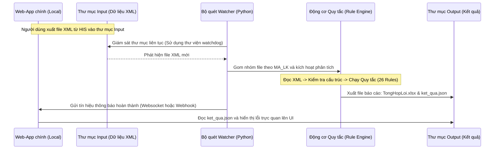

# TÀI LIỆU ĐẶC TẢ KỸ THUẬT: MÔ-ĐUN KIỂM TRA LỖI HỒ SƠ XML (BHYT)
*Dành cho Agent/Developer thực hiện lập trình và tích hợp*

Tài liệu này mô tả chi tiết yêu cầu kỹ thuật, kiến trúc mô-đun, các quy tắc nghiệp vụ kiểm tra và phương thức tích hợp cho mô-đun **XML Validator Tool**. Mô-đun này được thiết kế như một **công cụ độc lập (standalone module)** nhằm tích hợp vào một ứng dụng web cục bộ (local web-app) xử lý bảo hiểm hiện có.

---

## 📌 1. Nguyên tắc thiết kế mô-đun (Độc lập & Tích hợp nhẹ)

> [!IMPORTANT]
> **Yêu cầu cốt lõi:** Mô-đun này phải hoàn toàn độc lập với mã nguồn lõi của web-app hiện có. Nó tương tác với ứng dụng chính thông qua **File System (Thư mục quét tự động)** và **API/JSON kết quả**. Không được thay đổi cấu trúc cơ sở dữ liệu hoặc luồng hoạt động chính của ứng dụng hiện tại.

*   **Tính độc lập:** Mô-đun chạy như một tiến trình nền (background worker) hoặc một service riêng biệt bằng Python.
*   **Cơ chế kích hoạt (Trigger):**
    *   **Tự động:** Quét (watch) một thư mục chỉ định (`Input Folder`). Khi phát hiện có file XML mới xuất hiện, mô-đun tự động chạy phân tích.
    *   **Thủ công:** Web-app chính gọi đến một Endpoint API cục bộ của mô-đun để yêu cầu kiểm tra thư mục hoặc file cụ thể.
*   **Cơ chế đầu ra (Output):** Xuất báo cáo lỗi chi tiết dưới dạng tệp `JSON` và `Excel` vào thư mục đầu ra (`Output Folder`). Web-app chính có thể đọc tệp JSON này để hiển thị giao diện báo cáo cho người dùng.

---

## 🛠️ 2. Luồng xử lý kỹ thuật của Mô-đun



---

## 📋 3. Định nghĩa các bảng dữ liệu XML (Theo chuẩn Bộ Y tế)

Khi phân tích, Agent cần nhận dạng các file XML theo quy ước chuẩn:
*   **XML1 (Bảng 1):** Chỉ tiêu tổng hợp khám bệnh, chữa bệnh (Thông tin hành chính, bệnh chính, loại KCB, mã liên kết `MA_LK`).
*   **XML2 (Bảng 2):** Chỉ tiêu chi tiết thuốc thanh toán BHYT.
*   **XML3 (Bảng 3):** Chỉ tiêu chi tiết dịch vụ kỹ thuật và vật tư y tế.
*   **XML4 (Bảng 4):** Chỉ tiêu kết quả cận lâm sàng (Kết quả chẩn đoán hình ảnh, xét nghiệm).
*   **XML5 (Bảng 5):** Chỉ tiêu theo dõi diễn biến lâm sàng.
*   **XML7 (Bảng 7):** Giấy ra viện / Giấy tờ chuyển tuyến.
*   **XML8 (Bảng 8):** Tóm tắt bệnh án.
*   **XML9 (Bảng 9):** Bảng kê chi phí KCB.
*   **XML13 (Bảng 13):** Bảng kê chi tiết hồ sơ khác.

---

## 🔍 4. Danh mục 26 Quy tắc Kiểm tra lỗi (Rule Dictionary)

Dưới đây là danh sách các quy tắc kiểm tra cần được lập trình cứng trong Động cơ quy tắc (`rule_engine.py`). Mọi kiểm tra lỗi phải liên kết theo trường `<MA_LK>` (Mã liên kết hồ sơ).

### Nhóm A: Kiểm tra lỗi định dạng và Ràng buộc bắt buộc (Không để trống)

| STT | Mã lỗi XML | Thẻ cần kiểm tra | Logic kiểm tra của Agent | Mô tả lỗi hiển thị |
| :---: | :---: | :--- | :--- | :--- |
| **A1** | **XML1** | `<MA_BENH_CHINH>`| Bắt buộc có giá trị. Trimming khoảng trắng, không được rỗng. | `MA_BENH_CHINH không được để trống` |
| **A2** | **XML1** | `<NAM_QT>` | Bắt buộc có giá trị (Năm quyết toán). | `NAM_QT không được để trống` |
| **A3** | **XML2** | `<MA_THUOC>` | Bắt buộc có giá trị đối với mọi bản ghi thuốc. | `MA_THUOC không được để trống` |
| **A4** | **XML3** | `<MA_BAC_SI>` | Bắt buộc có mã bác sĩ chỉ định/thực hiện dịch vụ. | `MA_BAC_SI không được để trống` |
| **A5** | **XML4** | `<MA_BS_DOC_KQ>`| Bắt buộc có mã bác sĩ đọc kết quả cận lâm sàng. | `MA_BS_DOC_KQ không được để trống` |
| **A6** | **XML5** | `<DIEN_BIEN_LS>`| Bắt buộc có nội dung diễn biến lâm sàng của bệnh nhân. | `DIEN_BIEN_LS không được để trống` |
| **A7** | **XML5** | `<NGUOI_THUC_HIEN>`| Bắt buộc nhập người thực hiện theo dõi diễn biến. | `NGUOI_THUC_HIEN không được để trống` |
| **A8** | **XML8** | `<MA_TTDV>` | Bắt buộc có mã trạng thái dịch vụ trong tóm tắt bệnh án.| `MA_TTDV không để trống` |
| **A9** | **XML8** | `<TOMTAT_KQ>` | Bắt buộc có tóm tắt kết quả bệnh án. | `TOMTAT_KQ không được để trống` |
| **A10**| **XML8** | `<PP_DIEUTRI>` | Bắt buộc có phương pháp điều trị của đợt bệnh. | `PP_DIEUTRI không được để trống` |
| **A11**| **XML8** | `<CHAN_DOAN_RV>`| Bắt buộc nhập chẩn đoán lúc ra viện. | `CHAN_DOAN_RV không được để trống` |
| **A12**| **XML9** | `<MA_TTDV>` | Bắt buộc có mã trạng thái dịch vụ trong bảng kê chi phí.| `MA_TTDV không được để trống` |
| **A13**| **XML13**| `<HO_TEN>` | Bắt buộc nhập họ tên bệnh nhân trong hồ sơ khác. | `HO_TEN không được để trống` |
| **A14**| **XML0** | `<MA_DICH_VU>` | Thẻ dịch vụ kỹ thuật không được để trống. | `MA_DICH_VU không được để trống` |
| **A15**| **XML0** | `<MA_VAT_TU>` | Thẻ mã vật tư y tế không được để trống. | `MA_VAT_TU không được để trống` |
| **A16**| **XML0** | `<MA_THUOC>` | Thẻ mã thuốc không được để trống. | `MA_THUOC không được để trống` |

### Nhóm B: Kiểm tra logic thời gian và Định dạng chuỗi (Regex)

| STT | Mã lỗi XML | Thẻ cần kiểm tra | Logic kiểm tra của Agent | Mô tả lỗi hiển thị |
| :---: | :---: | :--- | :--- | :--- |
| **B1** | **XML4** | `<NGAY_KQ>` | Phải định dạng `YYYYMMDDHHMM` và giá trị phải `≤` thời gian hệ thống hiện tại lúc quét file. | `NGAY_KQ không được lớn hơn thời gian hiện tại` |
| **B2** | **XML7** | `<NGOAITRU_TUNGAY>`| Giá trị ngày bắt đầu điều trị ngoại trú phải `≤` ngày ra viện `<NGAY_RA>` ở tệp XML1 có cùng `<MA_LK>`. | `NGOAITRU_TUNGAY không được lớn hơn NGAY_RA` |
| **B3** | **XML3** | `<NGAY_YL>` | Ngày y lệnh dịch vụ phải `≥` ngày vào viện `<NGAY_VAO>` trong tệp XML1 có cùng `<MA_LK>`. | `ngày y lệnh trước ngày vào viện.` |
| **B4** | **XML3** | `<TT_THAU>` | Định dạng thông tin thầu phải khớp biểu thức quy định: `Quyết định;Gói thầu;Nhóm thầu;...`. Nếu chuỗi không chứa đúng số lượng ký tự phân tách hoặc sai năm đấu thầu, báo lỗi. | `TT_THAU sai định dạng quy định`<br>`TT_THAU sai - Sai năm đấu thầu` |
| **B5** | **XML2** | `<TT_THAU>` | Tương tự quy tắc B4 nhưng áp dụng cho thẻ thầu thuốc trong tệp XML2. | `TT_THAU sai định dạng quy định`<br>`TT_THAU sai - Sai năm đấu thầu` |

### Nhóm C: Kiểm tra liên kết logic chéo (Cross-file Validation)

| STT | Tệp kiểm tra | Tệp đối chiếu | Logic kiểm tra chéo của Agent | Mô tả lỗi hiển thị |
| :---: | :---: | :---: | :--- | :--- |
| **C1** | **XML3** | **XML4** | Với mỗi bản ghi dịch vụ trong XML3 có nhóm chi phí `<MA_NHOM>` = 2 (Cận lâm sàng / CĐHA), bắt buộc trong tệp XML4 có cùng `<MA_LK>` phải tồn tại bản ghi kết quả cận lâm sàng tương ứng và trường `<KET_LUAN>` của bản ghi đó không được rỗng. | `KET_LUAN không được để trống khi XML3.MA_NHOM = 2.` |
| **C2** | **XML3** | **XML3** | Nếu bản ghi dịch vụ kỹ thuật trong XML3 có mã nhóm `<MA_NHOM>` nhận một trong các giá trị `[1, 2, 3, 8, 18]`, bắt buộc thẻ `<NGUOI_THUC_HIEN>` phải có giá trị. | `NGUOI_THUC_HIEN không được để trống khi mã nhóm bằng 1 2 3 8 18` |
| **C3** | **XML2** | **XML3** | Đối chiếu toàn bộ danh mục mã thuốc/mã dịch vụ điều trị `<MA_DICH_VU>` được kê trong XML2 (Chi tiết thuốc) xem mã này có khớp và nằm trong danh mục dịch vụ kỹ thuật đã chỉ định tại XML3 của bệnh nhân đó hay không. | `MA_DICH_VU <MÃ_DV> không nằm trong XML3.` |
| **C4** | **XML1** | **XML7** | Kiểm tra trường loại hình KCB `<MA_LOAI_KCB>` trong XML1. Nếu nhận giá trị `[3, 4, 9]` (Điều trị ngoại trú ban ngày, nội trú,...), bắt buộc phải có sự hiện diện của tệp XML7 (Giấy ra viện) của hồ sơ đó. | `MA_LOAI_KCB ở XML1 = 3,4,9 thì phải có XML7 (giấy ra viện).` |
| **C5** | **XML1** | **Mọi XML** | Tệp XML1 chứa thông tin định danh chính. Nếu XML1 bị lỗi định dạng nghiêm trọng (không phân tích cú pháp được) hoặc thiếu các thông tin cốt lõi, dừng ngay việc kiểm tra các tệp XML liên quan của hồ sơ này. | `Thông tin XML1 chưa chuẩn xác. Hệ thống tạm dừng check các XML liên quan.` |

---

## 💻 5. Cấu trúc thư mục mã nguồn đề xuất của công cụ độc lập

Agent lập trình nên tổ chức cấu trúc dự án độc lập như sau:

```text
xml-validator-module/
│
├── config.json             # Cấu hình đường dẫn thư mục Input/Output, cổng chạy service
├── main.py                 # Điểm khởi chạy chính (Quét thư mục hoặc chạy API Web Server)
├── watcher.py              # Sử dụng thư viện 'watchdog' giám sát thư mục Input tự động
├── xml_parser.py           # Phân tích cú pháp XML, nhóm file XML1-XML13 theo mã MA_LK
├── rule_engine.py          # Chứa toàn bộ logic kiểm tra của 26 quy tắc ở trên
├── report_generator.py     # Xuất kết quả phân tích lỗi ra file Excel (TongHopLoi.xlsx) và JSON
└── requirements.txt        # Các thư viện phụ thuộc (lxml, pandas, openpyxl, watchdog)
```

---

## 🔌 6. Hướng dẫn tích hợp cho Web-App chính

Mô-đun độc lập này cung cấp 2 phương thức tích hợp cho Web-App chính của bạn:

1.  **Tích hợp dựa trên sự kiện File (File-based Integration):**
    *   Web-app chính cấu hình xuất các tệp XML cần xử lý vào thư mục `Input/`.
    *   Mô-đun Python watcher phát hiện file, phân tích tự động trong nền (background) và tạo ra tệp kết quả `ket_qua.json` trong thư mục `Output/`.
    *   Web-app chính thiết lập cơ chế giám sát thư mục `Output/` hoặc nhận webhook/tín hiệu từ Python để đọc tệp `ket_qua.json` này và hiển thị giao diện báo cáo lỗi cho người dùng cuối.
2.  **Tích hợp qua HTTP REST API (API-based Integration):**
    *   Mô-đun Python chạy một API Web Server siêu nhẹ (ví dụ dùng `FastAPI` hoặc `Flask` chạy trên cổng `localhost:8000`).
    *   Web-app chính gửi yêu cầu POST: `POST http://localhost:8000/validate` với tham số là đường dẫn thư mục chứa tệp XML.
    *   Mô-đun Python xử lý đồng bộ hoặc bất đồng bộ và trả về kết quả cấu trúc lỗi dưới dạng JSON trực tiếp cho Web-app chính xử lý.
